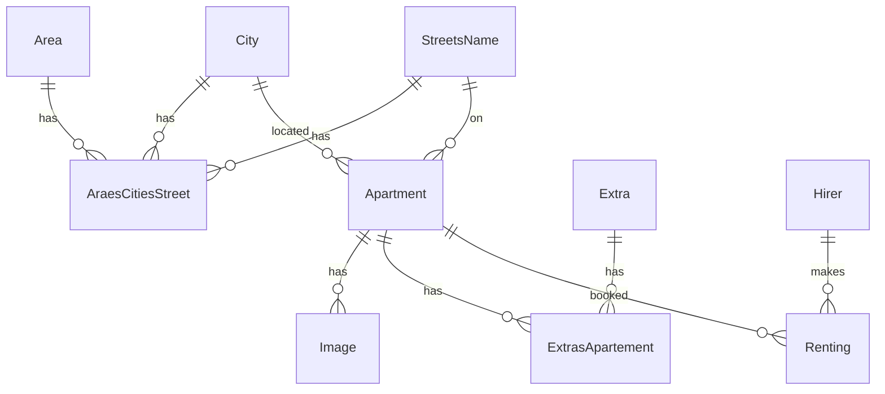
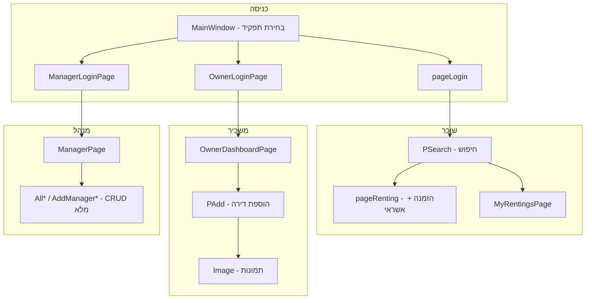

# תוכנית עבודה: מערכת "המשכיר" — פרויקט גמר

## אבחון: למה הפרויקט לא עובד היום

הארכיטקטורה **נכונה להגשה** (WPF → WCF → BL → DAL → EF6 → LocalDB), אבל יש באגים ששוברים את הליבה:

| בעיה | השפעה |
|------|--------|
| [`BLApartments.ConvertToDAL`](c:\Users\1\Downloads\Project\RacheliProject\BL\BLApartments.cs) כותב ל-DTO במקום ל-EF entity | **שמירת דירות לא עובדת** |
| [`BLAraesCitiesStreet.ConvertToDAL`](c:\Users\1\Downloads\Project\RacheliProject\BL\BLAraesCitiesStreet.cs) — מיפוי IdStreet שגוי | קישור אזור/עיר/רחוב שבור |
| Lazy loading אחרי סגירת DbContext | קריאות Get עם navigation properties נכשלות |
| Bindings שגויים ב-XAML (`userNameOwner` vs `NameOwner`) | טפסים לא שומרים נתונים |
| `RefreshData()` ריק ב-[`PSearch.xaml.cs`](c:\Users\1\Downloads\Project\WpfRentingApartementRacheli\WpfRentingApartementRacheli\PSearch.xaml.cs) | חיפוש לא מסנן |
| אין התחברות למנהל — כפתור "אזור אישי" פתוח לכולם | אין הפרדת תפקידים |
| נוסחת מחיר שגויה ב-[`pageRenting.xaml.cs`](c:\Users\1\Downloads\Project\WpfRentingApartementRacheli\WpfRentingApartementRacheli\pageRenting.xaml.cs) | סכום תשלום לא הגיוני |
| העלאת תמונות / Extras לדירה — stubs | פיצ'רים חסרים |

**החלטה:** לתקן ולהשלים את הקוד הקיים (לא rebuild). זמן משוער: **~16–20 שעות עבודה**.

---

## אפיון המערכת (מסמך דרישות להגשה)

### מטרה
מערכת לניהול והזמנת דירות לשכירות קצרה. שלושה סוגי משתמשים, בסיס נתונים relational, client-server ב-WCF.

### ישויות (לפי ERD שצירפת)



### תפקידים והרשאות

#### 1. מנהל מערכת (Admin)
- **כניסה:** שם משתמש `admin` + סיסמה `1234` (ב-[`Host\App.config`](c:\Users\1\Downloads\Project\RacheliProject\Host\App.config) — לא ב-DB)
- **יכולות:**
  - צפייה/עריכה/הוספה/מחיקה בכל הטבלאות: אזורים, ערים, רחובות, קישור אזור-עיר-רחוב, תוספות, דירות, תמונות, שוכרים, הזמנות
  - דוח רשימות (DataGrid) לכל entity
- **מסך:** [`ManagerPage`](c:\Users\1\Downloads\Project\WpfRentingApartementRacheli\WpfRentingApartementRacheli\ManagerPage.xaml) — רק אחרי login מנהל

#### 2. שוכר (Hirer)
- **כניסה:** תעודת זהות (9 ספרות, ולידציה [`IsId`](c:\Users\1\Downloads\Project\WpfRentingApartementRacheli\WpfRentingApartementRacheli\Validation.cs))
- **רישום:** שם בעברית + טלפון נייד (ולידציה קיימת)
- **יכולות:**
  - חיפוש דירות לפי: אזור, עיר, רחוב, טווח מחיר, מספר מיטות, תאריך (דירות תפוסות מסוננות החוצה)
  - צפייה בכרטיס דירה (תמונה, מיקום, חדרים, מיטות, מחיר)
  - הזמנה: תאריך + מספר מיטות + **פרטי אשראי (ולידציה בלבד)**
  - "ההזמנות שלי" — רשימת הזמנות של השוכר המחובר
- **מסכים:** [`pageLogin`](c:\Users\1\Downloads\Project\WpfRentingApartementRacheli\WpfRentingApartementRacheli\pageLogin.xaml) → [`PSearch`](c:\Users\1\Downloads\Project\WpfRentingApartementRacheli\WpfRentingApartementRacheli\PSearch.xaml) → [`pageRenting`](c:\Users\1\Downloads\Project\WpfRentingApartementRacheli\WpfRentingApartementRacheli\pageRenting.xaml) → `MyRentingsPage` (חדש)

#### 3. משכיר / בעל דירה (Owner)
- **כניסה:** שם בעלים + טלפון (מתאים לשדות `NameOwner` + `PhoneOwner` בדירה)
- **רישום:** אם לא קיים — טופס הוספת דירה ראשונה (= רישום משכיר)
- **יכולות:**
  - הוספת/עריכת **הדירות שלו בלבד**
  - העלאת תמונות לדירות שלו
  - צפייה בהזמנות שקיבל על דירותיו
- **מסכים:** `OwnerLoginPage` (מתקן [`LogInApartement`](c:\Users\1\Downloads\Project\WpfRentingApartementRacheli\WpfRentingApartementRacheli\LogInApartement.xaml)) → [`PAdd`](c:\Users\1\Downloads\Project\WpfRentingApartementRacheli\WpfRentingApartementRacheli\PAdd.xaml) → [`Image.xaml`](c:\Users\1\Downloads\Project\WpfRentingApartementRacheli\WpfRentingApartementRacheli\Image.xaml) → `OwnerDashboardPage` (חדש)

### כללי עסק (Business Rules)

| כלל | הגדרה |
|-----|--------|
| מחיר הזמנה | `SumPayment = MinimumPrice + (ExtraForBed × SumBeds)` — כאשר `SumBeds` = מספר מיטות שהשוכר מזמין |
| זמינות | דירה תפוסה אם קיימת הזמנה באותו `Date` (יום) |
| סטטוס דירה | רק דירות עם `Status = true` מוצגות בחיפוש |
| תשלום | ולידציה: מספר כרטיס (Luhn), CVV 3–4 ספרות, תוקף — **ללא חיוב אמיתי** |
| תמונה | קובץ נשמר בתיקיית `Pictures\` + שם הקובץ ב-DB (`Images.Image1`) |

### מפת מסכים (יעד סופי)



### ניווט עליון (MainWindow)
- **לפני login:** כפתורים — "שוכר" | "משכיר" | "מנהל"
- **אחרי login:** כפתורים לפי תפקיד בלבד + "יציאה"
- **הסרה:** גישה חופשית ל-ManagerPage ו-PAdd ללא login

---

## שלבי ביצוע (2 ימים)

### יום 1 — תשתית + שרת + נתונים (6–8 שעות)

> **איך לעבוד:** בצ'אט חדש כתבי **"משימה 1"**, **"משימה 2"** וכו'. כל משימה עצמאית, עם קriterion הצלחה ברור. בסוף כל משימה — build + בדיקה לפני המשימה הבאה.

---

#### משימה 1 — איחוד נתיב בסיס הנתונים (Connection Strings)
**זמן:** ~20 דקות | **קבצים:** 2

**מה לעשות:**
1. ב-[`Host\App.config`](c:\Users\1\Downloads\Project\RacheliProject\Host\App.config) — לשנות את `attachdbfilename` מ-`C:\DB\RentingAppartmentRacheli.mdf` ל:
   ```
   c:\Users\1\Downloads\Project\RentingAppartmentRacheli.mdf
   ```
2. ב-[`DAL\App.config`](c:\Users\1\Downloads\Project\RacheliProject\DAL\App.config) — לעדכן **את 3** connection strings (`RacheliEntities`, `RentingAppartmentRacheliEntities`, `RentingAppartmentRacheliEntities1`) לאותו נתיב.
3. לוודא ששני הקבצים קיימים בתיקיית הפרויקט:
   - `RentingAppartmentRacheli.mdf`
   - `RentingAppartmentRacheli_log.ldf`

**בדיקה:**
- Build של `RacheliProject.sln` — ללא שגיאות
- הרצת `Host.exe` — לא מופיעה שגיאת SQL attach

**✅ הצלחה:** Host נפתח ומציג `Service is running...`

---

#### משימה 2 — תיקיית תמונות + נתיב קבוע
**זמן:** ~15 דקות | **קבצים:** 1 (+ יצירת תיקייה)

**מה לעשות:**
1. ליצור תיקייה: `c:\Users\1\Downloads\Project\Pictures\`
2. ב-[`ImageClass.cs`](c:\Users\1\Downloads\Project\RacheliProject\BL\ImageClass.cs):
   - להחליף את `GetCurrentPath()` (שעולה 3 תיקיות למעלה — שביר) בנתיב קבוע:
     ```csharp
     return @"c:\Users\1\Downloads\Project\";
     ```
   - ב-`NextName()`: אם התיקייה לא קיימת — `Directory.CreateDirectory(path)` במקום `return null`
   - ב-`SaveImage()`: לוודא שהתיקייה נוצרת לפני שמירה

**בדיקה:**
- Build BL project
- (אופציונלי) קריאה ל-`ImageClass.SaveImage(byte[])` — קובץ `image1.jpg` נוצר ב-`Pictures\`

**✅ הצלחה:** תיקייה קיימת, `NextName()` לא מחזיר null

---

#### משימה 3 — תיקון `BLApartments.ConvertToDAL` (באג קריטי!)
**זמן:** ~20 דקות | **קבצים:** 1

**הבעיה:** שורות 39–48 ב-[`BLApartments.cs`](c:\Users\1\Downloads\Project\RacheliProject\BL\BLApartments.cs) כותבות ל-`aprtmntDTO` במקום ל-`aprtmntEF`.

**מה לעשות:** להחליף את `ConvertToDAL` כך שכל השדות נכתבים ל-`aprtmntEF`:
```csharp
public Apartment ConvertToDAL(DTOApartments aprtmntDTO)
{
    Apartment aprtmntEF = new Apartment();
    aprtmntEF.IdApartment = aprtmntDTO.IdApartment;
    aprtmntEF.NameOwner = aprtmntDTO.NameOwner;
    aprtmntEF.NumberHouse = aprtmntDTO.NumberHouse;
    aprtmntEF.Floor = aprtmntDTO.Floor;
    aprtmntEF.NumberRooms = aprtmntDTO.NumberRooms;
    aprtmntEF.NumberBeds = aprtmntDTO.NumberBeds;
    aprtmntEF.MinimumPrice = aprtmntDTO.MinimumPrice;
    aprtmntEF.ExtraForBed = aprtmntDTO.ExtraForBed;
    aprtmntEF.Status = aprtmntDTO.Status;
    aprtmntEF.note = aprtmntDTO.note;
    aprtmntEF.PhoneOwner = aprtmntDTO.PhoneOwner;
    if (aprtmntDTO.IdStreet != null)
        aprtmntEF.IdStreet = aprtmntDTO.IdStreet.IdStreet;
    if (aprtmntDTO.IdCities != null)
        aprtmntEF.IdCities = aprtmntDTO.IdCities.IdCity;
    return aprtmntEF;
}
```

**בדיקה:** Build + (אחרי משימה 10) AddApartments דרך WCF שומר דירה עם כל השדות

**✅ הצלחה:** דירה חדשה ב-DB עם NameOwner, IdStreet, IdCities, NumberHouse מלאים

---

#### משימה 4 — תיקון `BLAraesCitiesStreet.ConvertToDAL`
**זמן:** ~10 דקות | **קבצים:** 1

**הבעיה:** שורה 28 — `IdStreet = arctyDTO.IdArea.IdArea` (שגוי!)

**מה לעשות:** ב-[`BLAraesCitiesStreet.cs`](c:\Users\1\Downloads\Project\RacheliProject\BL\BLAraesCitiesStreet.cs):
```csharp
arctyEF.IdStreet = arctyDTO.IdStreetDTo.IdStreet;  // לא IdArea!
arctyEF.IdCities = arctyDTO.IdCities.IdCity;
arctyEF.IdArea = arctyDTO.IdArea.IdArea;
```

**✅ הצלחה:** AddAraesCitiesStreet שומר FK נכון לרחוב

---

#### משימה 5 — `.Include()` ב-DAL: Apartments + Rentings
**זמן:** ~25 דקות | **קבצים:** 2

**הבעיה:** `GetApartment()` מחזיר entities בלי navigation — BL קורס ב-`ConvertToDTO` כשמנסה `aprtmnt.StreetsName`.

**מה לעשות:**

**[`DALApartments.cs`](c:\Users\1\Downloads\Project\RacheliProject\DAL\DALApartments.cs)** — `GetApartment()`:
```csharp
using (RacheliEntities db = new RacheliEntities())
{
    return db.Apartments
        .Include(a => a.StreetsName)
        .Include(a => a.City)
        .ToList();
}
```

**[`DALRentings.cs`](c:\Users\1\Downloads\Project\RacheliProject\DAL\DALRentings.cs)** — `GetRentings()`:
```csharp
.Include(r => r.Hirer)
.Include(r => r.Apartment)
```

**✅ הצלחה:** `GetApartments()` ו-`GetTORentings()` מחזירים DTO עם שם עיר, רחוב, שוכר — לא null

---

#### משימה 6 — `.Include()` ב-DAL: AraesCitiesStreet + ExtrasApartements + Images
**זמן:** ~25 דקות | **קבצים:** 3

**[`DALAraesCitiesStreet.cs`](c:\Users\1\Downloads\Project\RacheliProject\DAL\DALAraesCitiesStreet.cs):**
```csharp
.Include(x => x.StreetsName)
.Include(x => x.City)
.Include(x => x.Area)
```

**[`DALExtrasApartements.cs`](c:\Users\1\Downloads\Project\RacheliProject\DAL\DALExtrasApartements.cs):**
```csharp
.Include(x => x.Extra)
.Include(x => x.Apartment)
```

**[`DALImages.cs`](c:\Users\1\Downloads\Project\RacheliProject\DAL\DALImages.cs):**
```csharp
.Include(x => x.Apartment)
```

**בונוס:** בכל Get methods — לעטוף ב-`using (RacheliEntities db = ...)` (מניעת דליפת context)

**✅ הצלחה:** כל 5 Get methods עם navigation עובדים ב-WCF

---

#### משימה 7 — Delete ב-DAL (תיקון + השלמה)
**זמן:** ~45 דקות | **קבצים:** 10 DAL files

**מה לעשות:** לכל entity — method `Delete` שעובד:

| Entity | PK | הערה |
|--------|-----|------|
| Apartment | `IdApartment` (int) | קיים — `Find(string)` **שבור**, לתקן ל-`Find(int)` |
| Area | `IdArea` (int) | אותו תיקון |
| City | `IdCity` (int) | אותו תיקון |
| Extra | `IdExtra` (int) | אותו תיקון |
| StreetsName | `IdStreet` (int) | **להוסיף** Delete |
| Hirer | `C_IDHirer` (string) | **להוסיף** Delete |
| Renting | `IdRenting` (int) | **להוסיף** Delete |
| AraesCitiesStreet | composite | **להוסיף** — מחיקה לפי 3 FK |
| ExtrasApartement | composite | **להוסיף** — מחיקה לפי IdExtra + IdAapartment |
| Image | composite | **להוסיף** — מחיקה לפי IdApartement + NumImage |

**דוגמה composite delete:**
```csharp
public bool Delete(int idStreet, int idCities, int idArea)
{
    using (var db = new RacheliEntities())
    {
        var ent = db.AraesCitiesStreet.Find(idStreet, idCities, idArea);
        if (ent == null) return false;
        db.AraesCitiesStreet.Remove(ent);
        db.SaveChanges();
        return true;
    }
}
```

**✅ הצלחה:** כל 10 entities יש Delete שעובד ב-DAL

---

#### משימה 8 — Delete ב-BL + WCF
**זמן:** ~45 דקות | **קבצים:** 10 BL + `IService1.cs` + `Service1.cs`

**מה לעשות:**
1. בכל BL class — method `DeleteX(...)` שקורא ל-DAL
2. ב-[`IService1.cs`](c:\Users\1\Downloads\Project\RacheliProject\Server\IService1.cs) — 10 `[OperationContract]` חדשים:
   - `DeleteApartment(int id)`
   - `DeleteArea(int id)`
   - `DeleteCity(int id)`
   - `DeleteExtra(int id)`
   - `DeleteStreetsName(int id)`
   - `DeleteHirer(string id)`
   - `DeleteRenting(int id)`
   - `DeleteAraesCitiesStreet(int idStreet, int idCities, int idArea)`
   - `DeleteExtrasApartement(int idExtra, int idApartment)`
   - `DeleteImage(int idApartment, int numImage)`
3. ב-[`Service1.cs`](c:\Users\1\Downloads\Project\RacheliProject\Server\Service1.cs) — implement כל method

**✅ הצלחה:** Build Server + Host, Delete methods מופיעים ב-WSDL

---

#### משימה 9 — תיקון Add methods ב-Service1 (החזרת bool אמיתי)
**זמן:** ~20 דקות | **קבצים:** 1

**הבעיה:** כל `Add*` ב-Service1 מחזיר `true` תמיד — גם כש-DAL נכשל.

**מה לעשות:** ב-[`Service1.cs`](c:\Users\1\Downloads\Project\RacheliProject\Server\Service1.cs) — כל Add method:
```csharp
public bool AddApartments(DTOApartments apartments)
{
    try
    {
        return new BLApartments().AddApartment(apartments);
    }
    catch { return false; }
}
```
(לחזור על כל 10 Add methods)

**✅ הצלחה:** Add עם FK שגוי מחזיר `false`

---

#### משימה 10 — Seed Data (נתוני הדגמה)
**זמן:** ~60 דקות | **קבצים:** חדש `Host\SeedData.cs` + עדכון `Program.cs`

**מה לעשות:**
1. ליצור class `SeedData` עם method `SeedIfEmpty()`
2. לקרוא מ-`Program.cs` לפני `myservice.Open()`
3. לבדוק `if (db.Areas.Any()) return;` — seed רק אם DB ריק
4. להכניס:

**Areas (3):**
| IdArea | NameArea |
|--------|----------|
| auto | צפון |
| auto | מרכז |
| auto | דרום |

**Cities (5):** חיפה, תל אביב, ירושלים, באר שבע, אילת

**StreetsNames (10):** הרצל, דיזנגoff, בן יehuda, רothschild, וכו'

**AraesCitiesStreet:** קישור כל עיר לאזור + 2-3 רחובות

**Extras (5):** מיזוג, חניה, WiFi, מרפסת, מעלית

**Apartments (5):** 2 משכירים שונים (NameOwner+PhoneOwner), מחירים 200-800, Status=true

**Hirers (3):** ת.ז. לדוגמה: `123456782`, `234567891`, `345678902` (עם ספרת ביקורת תקינה)

**Rentings (2):** 2 הזמנות על 2 דירות שונות

**Images (3):** placeholder — שמות קבצים ב-DB + 1-2 תמונות dummy ב-Pictures\

**✅ הצלחה:** אחרי הרצת Host — `GetApartments()` מחזיר 5 דירות, `GetTOHirers()` מחזיר 3

---

#### משימה 11 — Build מלא + בדיקת שרת
**זמן:** ~30 דקות | **קבצים:** 0 (בדיקות בלבד)

**מה לעשות:**
1. Build `RacheliProject.sln` — Debug, ללא warnings קריטיים
2. סגירת Host קודם אם רץ (פורט 8733)
3. הרצת `Host\bin\Debug\Host.exe`
4. בדיקות:

| # | בדיקה | URL/פעולה | תוצאה צפויה |
|---|--------|-----------|-------------|
| 1 | WSDL | `http://localhost:8733/Design_Time_Addresses/Server/Service1/?wsdl` | Status 200 |
| 2 | GetApartments | דרך WPF או test | 5 דירות + IdCities.NameCity לא null |
| 3 | GetTOHirers | | 3 שוכרים |
| 4 | GetTORentings | | 2 הזמנות + Hirer + Apartment |
| 5 | AddApartments | דירה חדשה | true + שדות מלאים ב-DB |
| 6 | DeleteApartment | מחיקת דירה test | true |

**✅ הצלחה:** כל 6 בדיקות עוברות — **יום 1 הושלם**

---

### סיכום יום 1 — רשימת משימות

| משימה | נושא | זמן | סטטוס |
|-------|------|-----|
| **1** | Connection strings | 20 דק | ✅ |
| **2** | Pictures + ImageClass | 15 דק | ✅ |
| **3** | BLApartments.ConvertToDAL | 20 דק | ✅ |
| **4** | BLAraesCitiesStreet.ConvertToDAL | 10 דק | ✅ |
| **5** | Include: Apartments + Rentings | 25 דק | ⏳ |
| **6** | Include: AraesCitiesStreet + Extras + Images | 25 דק | ⏳ |
| **7** | Delete ב-DAL | 45 דק | ⏳ |
| **8** | Delete ב-BL + WCF | 45 דק | ⏳ |
| **9** | Add bool fix ב-Service1 | 20 דק | ⏳ |
| **10** | Seed Data | 60 דק | ⏳ |
| **11** | Build + בדיקות | 30 דק | ⏳ |
| | **סה"כ** | **~5.5 שעות** |

---

### יום 2 — UI + זרימות + הגשה (8–10 שעות)

**שלב 2.1 — Global + Session**
עדכון [`Global.cs`](c:\Users\1\Downloads\Project\WpfRentingApartementRacheli\WpfRentingApartementRacheli\Global.cs):
```csharp
enum UserRole { None, Hirer, Owner, Manager }
static UserRole CurrentRole;
static DTOHirers CurrentHirer;
static DTOApartments CurrentOwner; // NameOwner+PhoneOwner
static void Logout() { ... }
```

**שלב 2.2 — מסך כניסה ראשי**
- [`MainWindow`](c:\Users\1\Downloads\Project\WpfRentingApartementRacheli\WpfRentingApartementRacheli\MainWindow.xaml): Title="המשכיר", 3 כפתורי כניסה
- `ManagerLoginPage` (חדש): admin/1234
- תיקון [`LogInApartement`](c:\Users\1\Downloads\Project\WpfRentingApartementRacheli\WpfRentingApartementRacheli\LogInApartement.xaml) → `OwnerLoginPage` + הוספה ל-csproj

**שלב 2.3 — זרימת שוכר (השלמה)**
- [`pageLogin`](c:\Users\1\Downloads\Project\WpfRentingApartementRacheli\WpfRentingApartementRacheli\pageLogin.xaml.cs): ולידציית ת.ז.
- [`PSearch`](c:\Users\1\Downloads\Project\WpfRentingApartementRacheli\WpfRentingApartementRacheli\PSearch.xaml.cs): מימוש `RefreshData()` — סינון לפי combo boxes, slider, תאריך, Status
- [`USCApartement`](c:\Users\1\Downloads\Project\WpfRentingApartementRacheli\WpfRentingApartementRacheli\USC\USCApartement.xaml): תיקון binding — `IdCities.NameCity`, `IdStreet.StreetName` (הסר `IdArea` או שליפה דרך join)
- [`pageRenting`](c:\Users\1\Downloads\Project\WpfRentingApartementRacheli\WpfRentingApartementRacheli\pageRenting.xaml): הוספת שדות אשראי + נוסחת מחיר נכונה
- `MyRentingsPage` (חדש): DataGrid של `GetTORentings()` מסונן לפי `CurrentHirer`

**שלב 2.4 — זרימת משכיר**
- [`PAdd`](c:\Users\1\Downloads\Project\WpfRentingApartementRacheli\WpfRentingApartementRacheli\PAdd.xaml): תיקון bindings ל-DTO (`NameOwner`, `PhoneOwner`, `IdCities`, `IdStreet`, `NumberHouse`...)
- טעינת ComboBox רחובות לפי עיר נבחרת
- [`Image.xaml`](c:\Users\1\Downloads\Project\WpfRentingApartementRacheli\WpfRentingApartementRacheli\Image.xaml): חיבור ל-`ImageManager.UploadImage_Dlg()` + `AddImages`
- `OwnerDashboardPage`: רשימת דירות של המשכיר + הזמנות עליהן

**שלב 2.5 — זרימת מנהל (השלמת CRUD)**
- [`ManagerPage`](c:\Users\1\Downloads\Project\WpfRentingApartementRacheli\WpfRentingApartementRacheli\ManagerPage.xaml): guard — redirect אם לא Manager
- השלמת handlers ריקים:
  - [`AllRentings`](c:\Users\1\Downloads\Project\WpfRentingApartementRacheli\WpfRentingApartementRacheli\AllRentings.xaml.cs) — מחיקה
  - [`AllExtrasApartements`](c:\Users\1\Downloads\Project\WpfRentingApartementRacheli\WpfRentingApartementRacheli\AllExtrasApartements.xaml.cs) — CRUD מלא
  - [`AddManagerImages`](c:\Users\1\Downloads\Project\WpfRentingApartementRacheli\WpfRentingApartementRacheli\AddManagerImages.xaml.cs), [`AddManagerAraesCitiesStreet`](c:\Users\1\Downloads\Project\WpfRentingApartementRacheli\WpfRentingApartementRacheli\AddManagerAraesCitiesStreet.xaml.cs)
  - Delete בכל `All*` pages
- תיקון navigation שגוי (hirer update → AllHirers ולא AllAreas)
- תיקון [`AddManagerCities`](c:\Users\1\Downloads\Project\WpfRentingApartementRacheli\WpfRentingApartementRacheli\AddManagerCities.xaml.cs) constructor bug

**שלב 2.6 — UI polish + ניקוי**
- RTL עקבי, הודעות בעברית
- הסרת/הסתרת orphan pages: [`LookForApartement`](c:\Users\1\Downloads\Project\WpfRentingApartementRacheli\WpfRentingApartementRacheli\LookForApartement.xaml), [`AddApartement`](c:\Users\1\Downloads\Project\WpfRentingApartementRacheli\WpfRentingApartementRacheli\AddApartement.xaml)
- Title windows בעברית

**שלב 2.7 — מסמכי הגשה**
- `README.md`: הוראות הרצה (1. Host.exe 2. WPF.exe)
- תרשים ER (יש — מהתמונה)
- תיאור מערכת (3 תפקידים — מה שהתלמידה כתבה + הרחבה)
- צילומי מסך לכל זרימה

---

## רשימת בדיקות לפני הגשה

| # | בדיקה | תפקיד |
|---|--------|-------|
| 1 | Host.exe עולה, WPF מתחבר | כללי |
| 2 | שוכר נרשם + נכנס + רואה דירות | Hirer |
| 3 | סינון לפי עיר/מחיר/תאריך עובד | Hirer |
| 4 | הזמנה עם אשראי לא תקין נדחית | Hirer |
| 5 | הזמנה תקינה נשמרת + מופיעה ב"ההזמנות שלי" | Hirer |
| 6 | הזמנה לתאריך תפוס — נחסמת | Hirer |
| 7 | משכיר מוסיף דירה + תמונה | Owner |
| 8 | משכיר רואה הזמנות על דירותיו | Owner |
| 9 | מנהל נכנס admin/1234 | Manager |
| 10 | CRUD מלא על כל 10 טבלאות | Manager |
| 11 | מחיקה עובדת | Manager |
| 12 | יציאה + חזרה לlogin | כללי |

---

## קבצים מרכזיים לעריכה

**Backend (יום 1):**
- [`BLApartments.cs`](c:\Users\1\Downloads\Project\RacheliProject\BL\BLApartments.cs), [`BLAraesCitiesStreet.cs`](c:\Users\1\Downloads\Project\RacheliProject\BL\BLAraesCitiesStreet.cs)
- [`DALApartments.cs`](c:\Users\1\Downloads\Project\RacheliProject\DAL\DALApartments.cs) + שאר DAL Get methods
- [`IService1.cs`](c:\Users\1\Downloads\Project\RacheliProject\Server\IService1.cs) / [`Service1.cs`](c:\Users\1\Downloads\Project\RacheliProject\Server\Service1.cs) — Delete methods
- [`Host\App.config`](c:\Users\1\Downloads\Project\RacheliProject\Host\App.config)

**Frontend (יום 2):**
- [`Global.cs`](c:\Users\1\Downloads\Project\WpfRentingApartementRacheli\WpfRentingApartementRacheli\Global.cs), [`MainWindow.xaml`](c:\Users\1\Downloads\Project\WpfRentingApartementRacheli\WpfRentingApartementRacheli\MainWindow.xaml)
- [`PSearch.xaml.cs`](c:\Users\1\Downloads\Project\WpfRentingApartementRacheli\WpfRentingApartementRacheli\PSearch.xaml.cs), [`pageRenting.xaml`](c:\Users\1\Downloads\Project\WpfRentingApartementRacheli\WpfRentingApartementRacheli\pageRenting.xaml)
- [`PAdd.xaml`](c:\Users\1\Downloads\Project\WpfRentingApartementRacheli\WpfRentingApartementRacheli\PAdd.xaml), [`Image.xaml`](c:\Users\1\Downloads\Project\WpfRentingApartementRacheli\WpfRentingApartementRacheli\Image.xaml)
- [`ManagerPage`](c:\Users\1\Downloads\Project\WpfRentingApartementRacheli\WpfRentingApartementRacheli\ManagerPage.xaml) + כל `All*` / `AddManager*`
- 3 מסכים חדשים: `ManagerLoginPage`, `MyRentingsPage`, `OwnerDashboardPage`

---

## מה **לא** נוגעים (לחיסכון בזמן)

- שינוי טכנולוגיה (ASP.NET, React...)
- תשלום אמיתי
- הצפנת סיסמאות (פרויקט גמר — admin hardcoded מספיק)
- Refactor מלא של שמות (Araes, Addentings...) — רק תיקונים פונקציונליים
